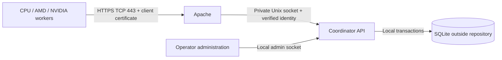

# Coordinator server, authentication, and project storage

Status: proposed design; no server, DNS, firewall, or certificates have been
configured. This document refines sections 7–8 and C12/C15 of the
[GPU redesign plan](GPU_REDESIGN_PLAN.md).

## 1. Recommended deployment

Run a dedicated coordinator service on the home server. Apache accepts HTTPS
requests, authenticates client certificates, and forwards requests to the service.
Only the coordinator opens SQLite. GPU clients call the API to obtain work and
report progress; they never download, mount, or directly modify the database.

Use `https://dbkeyprogress.rumahsimanis.bagus.my.id` as the proposed public origin.
It uses TCP **443**, so the URL needs no explicit port. This domain is a deployment
example supplied by the operator; its DNS, certificate, and reachability have not
been checked as part of planning.

| Component | Proposed location or boundary |
| --- | --- |
| Public API | `https://dbkeyprogress.rumahsimanis.bagus.my.id/api/v1/` |
| Apache | Dedicated virtual host on TCP 443; server TLS and required client authentication |
| Coordinator API listener | `/run/keyhunt-coordinator/api.sock`; no public backend TCP port |
| Local administration | Separate privileged Unix socket; not proxied by Apache |
| Authoritative state | `/var/lib/keyhunt-coordinator/progress.sqlite`, including adjacent WAL/SHM files |
| Server configuration | `/etc/keyhunt-coordinator/` |
| Worker configuration/credentials | User configuration directory outside its checkout, such as `~/.config/keyhunt/` |
| Worker retry outbox/cache | User state directory outside its checkout, such as `~/.local/state/keyhunt/` |
| Source repository | Code, schema migrations, deployment templates, and synthetic test fixtures only |

Run the coordinator as a dedicated service user. That user owns the database
directory; Apache only needs permission to connect to the API socket. Protect
the socket directory so other local users cannot inject requests. The web document
root, repository, and backup directories must not overlap. Production databases,
WAL/SHM files, private keys, and runtime configuration do not belong in Git.

Keep an explicit standalone mode for offline use, with state under the user's
state directory. In distributed mode, the server's journal is authoritative;
worker caches/outboxes cannot independently declare global ranges complete.

## 2. Public/private keys: use mutual TLS

Recommend mutual TLS (mTLS) with one client key pair and certificate per machine.
This uses the public/private-key authentication already supported by Apache and
standard HTTPS clients. Apache can require a certificate signed by a configured
client CA. [Apache client authentication][apache-auth]

There are three separate credentials:

| Credential | Purpose | Private-key owner |
| --- | --- | --- |
| Public HTTPS server certificate | Workers verify the requested domain and encrypted connection | Home server, readable by the TLS service |
| Client certificate and key | Server authenticates one registered worker or operator | That client only |
| Private client certificate authority (CA) | Operator approves new client certificates | Operator's protected administration machine; keep the signing key off the public server |

Use a publicly trusted server certificate for the domain, for example through
ACME. The private client CA is separate from the server-certificate issuer.
Apache needs the client CA's public certificate, not its signing key. A client
proves possession of its private key during TLS; it does not send that key to the
server. Implement this with established TLS/X.509 libraries, not a custom request
signature or key-exchange protocol.

### Enrollment, renewal, and revocation

1. Bootstrap the first operator through the local admin interface on the server.
   There is no public unauthenticated enrollment endpoint.
2. Each client generates its private key locally and sends only a certificate
   signing request (CSR) to the operator through an established channel.
3. The operator checks which machine is enrolling, issues a short-lived client
   certificate with client-auth usage, and registers its certificate fingerprint
   and public-key fingerprint against a stable `client_id`.
4. The operator grants that client roles on explicitly selected project IDs.
   Possessing a CA-signed certificate alone grants no project permissions.
5. The client installs the returned certificate beside its private key and uses
   normal server hostname/chain verification. No `--insecure` client mode in the
   production quickstart.
6. Renew certificates before expiry; an initial policy is 90-day validity with
   notification 30 days before expiration. Allow overlapping credentials for the
   same client during rotation, then disable the old credential. Automate renewal
   under the same enrollment controls after the manual flow is validated.
7. Revoke a certificate or disable a whole client in the coordinator registry.
   Recheck credential status, validity, and project membership on every request,
   including requests on existing TLS connections. Revocation must not depend
   solely on a later TLS handshake or certificate expiration.

Record certificate issuer/serial, validity dates, fingerprints, registration,
rotation, and revocation in the audit trail. Bind authentication to the registered
certificate, not a client-supplied machine name or certificate common name.
During CA rotation, temporarily trust both approved issuers and keep their
identities distinct. The local admin interface provides recovery if a remote
operator certificate expires.

### Trusted identity between Apache and the API

Apache requires a valid client certificate for the entire dedicated API virtual
host. The coordinator receives the TLS verification result and an encoded client
certificate through narrowly defined internal request headers. Apache must remove
all incoming copies of those headers and set them from the actual TLS connection.
Use a single-line encoding for the certificate; never insert raw multiline PEM
into an HTTP header. These mechanics use Apache's SSL variables and request-header
controls. [mod_ssl][apache-ssl], [mod_headers][apache-headers]

The service accepts this identity only over the protected Apache API socket,
requires verification success, parses the certificate, and resolves its registered
fingerprint. Missing, duplicate, malformed, or unregistered identity is rejected.
The application never trusts an external `client_id`, `X-Forwarded-*` identity,
or a header supplied by the worker. Certificate forwarding and header overwrite
behavior require integration tests against the deployed Apache version.

Do not enable a second HTTP listener that bypasses this boundary. The separate
local admin socket uses operating-system permissions and does not accept the
remote API's identity headers as an administrative credential.

## 3. Projects and access control

Start with **one SQLite database containing project-scoped records**. This is the
simplest initial model: one migration/backup stream, and permissions, leases,
results, and progress can be checked and committed in the same transaction.
There is no need to choose database filenames from untrusted URL input.

A project is an access-control container identified by an opaque server-generated
UUID. Give it a human-readable name separately. A job is an immutable search
manifest within that project. A project can hold several jobs for different
ranges/targets. Identical job digests in different projects remain isolated.

| Entity | Scope and key rules |
| --- | --- |
| `clients`, `credentials` | Global authenticated principals; exact registered certificates and active status |
| `projects` | Server-generated `project_id`, display name, active/archive state |
| `project_memberships` | Unique `(project_id, client_id)` and assigned role |
| `jobs` | Composite identity `(project_id, job_id)`; manifest digest stored within that scope |
| `leases`, `coverage`, `results`, `exports` | Carry `project_id` and `job_id`; composite foreign keys prevent references into a different project |
| `idempotency_records` | Scoped by project, authenticated client, operation, and request key; retain request digest and committed response |
| `events` | Project scope, actor/credential identity, operation, transaction sequence, and affected work |

Every query and mutation filters by the authorized project. Use composite
uniqueness constraints and indexes beginning with project/job identity. SQLite
does not supply this application's row-access policy automatically; put it in a
shared authorization/repository layer and test every endpoint for cross-project
access. A guessed UUID or job digest never grants permission.

| Role | Allowed operations |
| --- | --- |
| Reader | Read that project's job metadata, unfinished-block previews, and progress |
| Worker | Reader access plus claim work, heartbeat, submit results/progress, complete or release its own valid leases |
| Project owner | Create/manage jobs, pause a project/job, manage memberships, inspect results, and control offline assignments within that project |
| Service administrator | Local administration of projects, credentials, recovery, and backups |

Workers cannot overwrite arbitrary coverage, complete another client's lease,
modify job identity, grant access, or delete progress. Result data access is
separately restricted; reading progress need not grant access to every discovered
result. An unauthorized project is not listed and returns the same not-found
response as an unknown project. Rate limits and request-size limits apply per
registered client and project.

Use one serialized write queue or short `BEGIN IMMEDIATE` transactions. Check
current credential/membership status and lease generation inside the same
transaction as each write. A revocation committed first blocks subsequent writes;
an already committed operation remains in the audit history. Reads also verify
current authorization rather than using an indefinitely cached grant.

Per-project database files can be added if independent backup/retention or measured
write contention later justifies them. That change requires an explicit catalog,
authorization consistency, migration, and backup design. It is not needed to
organize or isolate the initial projects.

## 4. API and reliable progress updates

Use versioned JSON endpoints under `/api/v1/projects/{project_id}/jobs/{job_id}`.
Absolute scalar values and large block IDs remain canonical hex strings, as
specified in the main plan. Resolve client identity from authentication; request
bodies cannot override the lease owner.

| Method and relative path | Action |
| --- | --- |
| `GET /status` | Read exact completed, leased, partial, and available coverage totals |
| `GET /blocks?state=unfinished&cursor=...&limit=...` | Bounded preview of unfinished ranges; does not reserve work |
| `POST /leases` | Atomically select and claim sequential, random, or explicitly chosen block work |
| `POST /leases/{lease_id}/heartbeat` | Renew the caller's current lease |
| `POST /leases/{lease_id}/progress` | Submit verified results and contiguous progress together |
| `POST /leases/{lease_id}/complete` | Finish only a fully processed and durably committed lease |
| `POST /leases/{lease_id}/release` | Preserve acknowledged coverage and release remaining work |

Membership and job administration have separate owner-authorized endpoints. Do
not expose SQL execution, generic table writes, SQLite downloads, or web-based
database administration. Status responses use `Cache-Control: no-store` and are
not served through a shared response cache.

An unfinished-block read is only a preview; work begins after a successful atomic
claim. Every mutation carries an idempotency key. Reusing a key with a different
payload is rejected; a retry with the same payload returns its original committed
response. Each lease operation checks project/job identity, owner, server epoch,
generation, expiry, and exact bounds before advancing coverage.

Use the durable result-before-coverage ordering and fencing rules from the main
plan. A successful acknowledgment is sent only after the SQLite transaction has
committed. Requests perform short metadata work, never the GPU search itself.
On a busy database or unavailable service, return an explicit retryable response;
clients back off with jitter and reuse the original idempotency key.

Keep exact scalar/coverage records separate from untrusted performance telemetry.
The coordinator validates reported candidates and interval consistency, but an
authenticated client's claim of exhaustive no-match computation is still a trust
assumption. mTLS identifies clients; it is not a proof that work was performed.

### Request budget and adaptive lease sizing

Apply the [block-sizing policy](GPU_REDESIGN_PLAN.md#concrete-sizing-and-adaptation):
logical block IDs stay fixed, while a worker's future lease spans target about
180 seconds of measured work. Small kernel batches/checkpoints keep pause and
replay bounds independent of that span. Larger leases reduce claim traffic; they
do not justify longer gaps between durable checkpoints.

For illustration, 64 active device workers checkpointing every 10 seconds produce
about 6.4 progress requests/s. Separate 15-second heartbeats add about 4.27/s, and
180-second leases add about 0.36 claims/s, before completion requests, retries,
status reads, or results. This arithmetic is not a SQLite capacity measurement.
Coalesce renewals with progress where the protocol permits, jitter scheduling,
and benchmark durable transactions on the actual server disk. Keep healthy-worker
lease renewals and progress prioritized during status/telemetry load.

Count unique accepted coverage independently of worker-reported speed. Bound each
client's outstanding leases and newly requested span; observed committed progress
informs future sizing. Follow the main plan's execution-provenance and invalidation
rules when a software defect requires a range to be searched again.

## 5. Apache, HTTPS, and home-network setup

Implement a reviewed deployment template under `deploy/apache/` and a service
unit under `deploy/systemd/`. The following are requirements for those templates,
not a ready-to-install configuration:

- Use an updated supported Apache/OpenSSL stack with `mod_ssl`, `mod_proxy`,
  `mod_proxy_http`, and `mod_headers`. Configure the dedicated domain on port 443,
  the public server certificate/full chain, and its private key.
- Require TLS 1.2 or 1.3 and mandatory client certificates across the whole API
  virtual host (`SSLVerifyClient require`). Configure the private client CA trust
  and a verification depth matching the issuing chain. Restrict certificate
  usage to approved client-auth credentials.
- Proxy only API paths to the protected Unix socket with `ProxyRequests Off`.
  Apache supports Unix-socket targets for reverse proxying. Unknown paths must
  not expose server files. [Apache proxy documentation][apache-proxy]
- Enforce the certificate-forwarding contract above. Validate Host/SNI behavior
  and reject mismatched authorities so another virtual host cannot bypass client
  authentication. Keep mutation requests out of TLS early-data/replay paths.
- Set explicit request/body/time limits and no-cache API responses. Keep logs
  useful for request IDs, client IDs, and project IDs without logging credentials
  or sensitive result bodies.

Publish DNS A/AAAA records only for addresses that reach this Apache host. If
behind a router, forward **WAN TCP 443 to the Apache host's TCP 443** and allow it
through the host firewall; do not forward a coordinator backend port. Configure
IPv6 filtering as well if publishing AAAA. If the ISP uses CGNAT or blocks inbound
443, direct hosting needs an inbound-reachable connection or a separately designed
TCP tunnel. Use DNS-only hosting initially; a CDN that terminates TLS would change
where client authentication happens.

For the public server certificate, prefer automated ACME DNS-01 if the DNS provider
supports scoped API access. This permits API operation with only TCP 443 exposed.
If using HTTP-01 instead, certificate validation requires TCP 80 and an ACME
challenge route; never accept API mutations on plain HTTP. Redirecting an API
write is not the access-control mechanism. [ACME challenge types][acme]

The private client CA signs worker certificates independently of ACME. Test server
certificate renewal, client certificate renewal, and Apache reload separately.
The domain certificate must match the domain used by clients; a nonstandard TCP
port would still require authentication and TLS, and offers no substitute for them.

## 6. Reliability and operation

Keep SQLite on local server storage with WAL, foreign keys, busy handling, and
`synchronous=FULL`. Batch checkpoints rather than storing per-key writes. Remote
workers access HTTPS only; SQLite's WAL sharing remains local to one host.
[SQLite WAL documentation][sqlite-wal]

Run one authoritative coordinator with supervised restart. Monitor free disk,
commit latency, WAL growth, certificate expiry, overdue leases, outbox backlog,
and backup age. A failed durable write returns an error and never reports a block
finished. Follow the existing bounded-checkpoint and lease-renewal behavior during
home internet or power outages: no new global allocation while disconnected;
unacknowledged progress remains in the worker's durable outbox.

Back up through SQLite's online backup API, including all project data and
credential/membership state in the consistent snapshot. Protect a separate copy
off the server and rehearse restores; copying only a live `.sqlite` file can miss
WAL contents. [SQLite backup documentation][sqlite-backup]

Restoring an older backup can lose already acknowledged progress. Choose and
publish a recovery-point target, reconcile retained worker receipts/outboxes, and
otherwise replay missing work. Generate a new unpredictable coordinator epoch
after restore so stale pre-restore leases cannot become valid again. Reconcile
credential revocations against retained operator audit records before reopening
public access: an old backup must not silently re-enable a revoked client.

The initial availability model is one server with recoverable downtime. Do not
run two independent writable copies behind a load balancer. A UPS and external
backups improve home operation; high availability would require a later storage
and coordination design.

## 7. Implementation slices and acceptance gates

These refine C12/C15 in the main plan. Each row is a separate implementation
commit (split further when necessary); documentation and tests travel with it.

| Slice | Change | Required evidence |
| --- | --- | --- |
| S01 / C12 | External state-directory defaults and project-scoped schema/migrations | No runtime state in checkout; project foreign keys, scoping, and backup/restore tested |
| S02 / C15 | Local admin enrollment, credential registry, project memberships | Explicit bootstrap; unknown/revoked/expired credentials and wrong-project access denied |
| S03 / C15 | Apache mTLS boundary and private socket integration | Required certificates; forged/duplicate headers, wrong CA, Host/SNI mismatch, and socket bypass tests fail closed |
| S04 / C15 | Authorized lease/progress API and HTTPS worker client | Transactional claims; replay-safe retries; ownership/generation checks; revocation on existing connections |
| S05 / C15 | Service packaging, renewal, backups, and recovery guide | Restart/power/network/disk-full tests; restore invalidates old leases and preserves access-control policy |
| S06 / C15 | Two-host and public-ingress validation | Registered clients can read/claim/update only permitted projects; unauthenticated requests read/write nothing; TCP 443 and renewal verified |

The acceptance suite must include two projects with identical job manifests, two
clients with different roles, concurrent claims for the same block, and all API
routes exercised across both projects. Test an acknowledged commit whose response
is lost, and a credential revoked between two requests on the same connection.

Deployment-specific details to confirm during implementation: home server OS and
Apache/OpenSSL versions, direct public IPv4/IPv6 reachability, DNS automation,
certificate issuance workflow, state-disk capacity, and backup recovery target.
These do not prevent recording or implementing the proposed service interfaces.

## References

Primary documentation consulted for this planning revision:

- [Apache client certificate authentication][apache-auth]
- [Apache SSL variables and configuration][apache-ssl]
- [Apache request-header controls][apache-headers]
- [Apache reverse proxy and Unix sockets][apache-proxy]
- [ACME challenge types][acme]
- [SQLite WAL][sqlite-wal] and [online backup][sqlite-backup]

[apache-auth]: https://httpd.apache.org/docs/2.4/ssl/ssl_howto.html#accesscontrol
[apache-ssl]: https://httpd.apache.org/docs/2.4/mod/mod_ssl.html
[apache-headers]: https://httpd.apache.org/docs/2.4/mod/mod_headers.html
[apache-proxy]: https://httpd.apache.org/docs/2.4/mod/mod_proxy.html#proxypass
[acme]: https://letsencrypt.org/docs/challenge-types/
[sqlite-wal]: https://www.sqlite.org/wal.html
[sqlite-backup]: https://www.sqlite.org/backup.html
