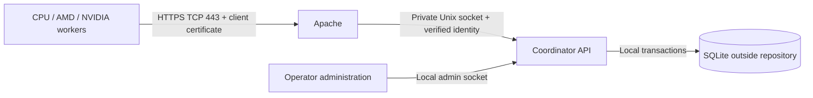

# Coordinator server, authentication, and project storage

Status: proposed design; no server, DNS, firewall, or certificates have been
configured. This document refines sections 7–8 and C12/C15 of the
[GPU redesign plan](GPU_REDESIGN_PLAN.md).

S01/C12's [local storage foundation](STORAGE.md) is implemented: external private
directories, a versioned project-scoped schema, sparse transactional allocation,
fencing and quarantined backup/restore. Authentication, remote membership,
reconciled restore activation and the coordinator service remain C15 work.
C13 adds [verified standalone checkpoints](CHECKPOINTS.md); their acknowledgments
are local durability, not evidence of server acceptance or a synchronized outbox.

Current scheduling defaults: one distinct active block per GPU, about twelve hours
of computation per block on a calibrated reference GPU, local checkpoints every
ten seconds, a combined machine sync every two hours, and thirty-day renewable
assignments. Paused and disconnected blocks stay in-progress while owned.

## 1. Recommended deployment

Run a dedicated coordinator service on the home server. Apache accepts HTTPS
requests, authenticates client certificates, and forwards requests to the service.
Only the coordinator opens SQLite. GPU clients call the API to obtain work and
report progress; they never download, mount, or directly modify the database.

Use `https://dbkeyprogress.rumahsimanis.bagus.my.id` as the proposed public origin.
It uses TCP **443**, so the URL needs no explicit port. This domain is a deployment
example supplied by the operator; its DNS, certificate, and reachability have not
been checked as part of planning.

| Component | Proposed location or boundary |
| --- | --- |
| Public API | `https://dbkeyprogress.rumahsimanis.bagus.my.id/api/v1/` |
| Apache | Dedicated virtual host on TCP 443; server TLS and required client authentication |
| Coordinator API listener | `/run/keyhunt-coordinator/api.sock`; no public backend TCP port |
| Local administration | Separate privileged Unix socket; not proxied by Apache |
| Authoritative state | `/var/lib/keyhunt-coordinator/progress.sqlite`, including adjacent WAL/SHM files |
| Server configuration | `/etc/keyhunt-coordinator/` |
| Worker configuration/credentials | User configuration directory outside its checkout, such as `~/.config/keyhunt/` |
| Worker retry outbox/cache | User state directory outside its checkout, such as `~/.local/state/keyhunt/` |
| Source repository | Code, schema migrations, deployment templates, and synthetic test fixtures only |

Run the coordinator as a dedicated service user. That user owns the database
directory; Apache only needs permission to connect to the API socket. Protect
the socket directory so other local users cannot inject requests. The web document
root, repository, and backup directories must not overlap. Production databases,
WAL/SHM files, private keys, and runtime configuration do not belong in Git.

Keep an explicit standalone mode for offline use, with state under the user's
state directory. In distributed mode, the server's journal is authoritative;
worker caches/outboxes cannot independently declare global ranges complete.

## 2. Public/private keys: use mutual TLS

Recommend mutual TLS (mTLS) with one client key pair and certificate per machine.
This uses the public/private-key authentication already supported by Apache and
standard HTTPS clients. Apache can require a certificate signed by a configured
client CA. [Apache client authentication][apache-auth]

There are three separate credentials:

| Credential | Purpose | Private-key owner |
| --- | --- | --- |
| Public HTTPS server certificate | Workers verify the requested domain and encrypted connection | Home server, readable by the TLS service |
| Client certificate and key | Server authenticates one registered worker or operator | That client only |
| Private client certificate authority (CA) | Operator approves new client certificates | Operator's protected administration machine; keep the signing key off the public server |

Use a publicly trusted server certificate for the domain, for example through
ACME. The private client CA is separate from the server-certificate issuer.
Apache needs the client CA's public certificate, not its signing key. A client
proves possession of its private key during TLS; it does not send that key to the
server. Implement this with established TLS/X.509 libraries, not a custom request
signature or key-exchange protocol.

### Enrollment, renewal, and revocation

1. Bootstrap the first operator through the local admin interface on the server.
   There is no public unauthenticated enrollment endpoint.
2. Each client generates its private key locally and sends only a certificate
   signing request (CSR) to the operator through an established channel.
3. The operator checks which machine is enrolling, issues a short-lived client
   certificate with client-auth usage, and registers its certificate fingerprint
   and public-key fingerprint against a stable `client_id`.
4. The operator grants that client roles on explicitly selected project IDs.
   Possessing a CA-signed certificate alone grants no project permissions.
5. The client installs the returned certificate beside its private key and uses
   normal server hostname/chain verification. No `--insecure` client mode in the
   production quickstart.
6. Renew certificates before expiry; an initial policy is 90-day validity with
   notification 30 days before expiration. Allow overlapping credentials for the
   same client during rotation, then disable the old credential. Automate renewal
   under the same enrollment controls after the manual flow is validated.
7. Revoke a certificate or disable a whole client in the coordinator registry.
   Recheck credential status, validity, and project membership on every request,
   including requests on existing TLS connections. Revocation must not depend
   solely on a later TLS handshake or certificate expiration.

Record certificate issuer/serial, validity dates, fingerprints, registration,
rotation, and revocation in the audit trail. Bind authentication to the registered
certificate, not a client-supplied machine name or certificate common name.
During CA rotation, temporarily trust both approved issuers and keep their
identities distinct. The local admin interface provides recovery if a remote
operator certificate expires.

### Trusted identity between Apache and the API

Apache requires a valid client certificate for the entire dedicated API virtual
host. The coordinator receives the TLS verification result and an encoded client
certificate through narrowly defined internal request headers. Apache must remove
all incoming copies of those headers and set them from the actual TLS connection.
Use a single-line encoding for the certificate; never insert raw multiline PEM
into an HTTP header. These mechanics use Apache's SSL variables and request-header
controls. [mod_ssl][apache-ssl], [mod_headers][apache-headers]

The service accepts this identity only over the protected Apache API socket,
requires verification success, parses the certificate, and resolves its registered
fingerprint. Missing, duplicate, malformed, or unregistered identity is rejected.
The application never trusts an external `client_id`, `X-Forwarded-*` identity,
or a header supplied by the worker. Certificate forwarding and header overwrite
behavior require integration tests against the deployed Apache version.

Do not enable a second HTTP listener that bypasses this boundary. The separate
local admin socket uses operating-system permissions and does not accept the
remote API's identity headers as an administrative credential.

## 3. Projects and access control

Start with **one SQLite database containing project-scoped records**. This is the
simplest initial model: one migration/backup stream, and permissions, assignments,
results, and progress can be checked and committed in the same transaction.
There is no need to choose database filenames from untrusted URL input.

A project is an access-control container identified by an opaque server-generated
UUID. Give it a human-readable name separately. A job is an immutable search
manifest within that project. A project can hold several jobs for different
ranges/targets. Identical job digests in different projects remain isolated.

| Entity | Scope and key rules |
| --- | --- |
| `clients`, `credentials` | Global authenticated principals; exact registered certificates and active status |
| `projects` | Server-generated `project_id`, display name, active/archive state |
| `project_memberships` | Unique `(project_id, client_id)` and assigned role |
| `jobs` | Composite identity `(project_id, job_id)`; manifest digest stored within that scope |
| `assignments`, `coverage`, `results`, `exports` | Carry project/job/block identity; assignments record machine owner, generation and server-issued expiry; composite foreign keys prevent cross-project references |
| `idempotency_records` | Authenticated client, machine instance, operation, and request key; retain the authorized project/job scopes, immutable request digest, committed response, and original grant/renewal deadlines |
| `events` | Project scope, actor/credential identity, operation, transaction sequence, and affected work |

Every query and mutation filters by the authorized project. Use composite
uniqueness constraints and indexes beginning with project/job identity. SQLite
does not supply this application's row-access policy automatically; put it in a
shared authorization/repository layer and test every endpoint for cross-project
access. A guessed UUID or job digest never grants permission.

| Role | Allowed operations |
| --- | --- |
| Reader | Read that project's job metadata, unfinished-block previews, and progress |
| Worker | Reader access plus batched claims, renewals, results/progress, and completion for its own valid block assignments; returning unstarted spares is explicit |
| Project owner | Create/manage jobs, pause a project/job, manage memberships, inspect results, and control offline assignments within that project |
| Service administrator | Local administration of projects, credentials, recovery, and backups |

Workers cannot overwrite arbitrary coverage, complete another client's assignment,
modify job identity, grant access, or delete progress. Result data access is
separately restricted; reading progress need not grant access to every discovered
result. An unauthorized project is not listed and returns the same not-found
response as an unknown project. Rate limits and request-size limits apply per
registered client and project.

Use one serialized write queue or short `BEGIN IMMEDIATE` transactions. Check
current credential/membership status and assignment generation inside the same
transaction as each write. A revocation committed first blocks subsequent writes;
an already committed operation remains in the audit history. Reads also verify
current authorization rather than using an indefinitely cached grant.

Per-project database files can be added if independent backup/retention or measured
write contention later justifies them. That change requires an explicit catalog,
authorization consistency, migration, and backup design. It is not needed to
organize or isolate the initial projects.

## 4. API, block states, and batched synchronization

Use job-scoped reads under `/api/v1/projects/{project_id}/jobs/{job_id}` and a
machine-scoped `POST /api/v1/sync` that can aggregate all its GPUs/jobs in one
session. Verify authorization separately for every included project/job; one
project grant must not authorize another. Absolute scalar values and large block
IDs remain canonical hex strings. Resolve client identity from its certificate;
a body-supplied owner cannot override authentication.

### Three-state ownership model

| State | Meaning | General random/sequential claims |
| --- | --- | --- |
| `unexplored` | Available with no current assignment and no retained completed coverage | Allowed |
| `in_progress` | Assigned or partly completed, including queued, running, paused, stale, expired-needing-recovery, or locally complete awaiting upload | Denied |
| `finished` | Server accepted all required coverage and associated results | Denied |

Claiming unexplored blocks moves them to in-progress in the allocation transaction,
with machine identity, generation, and expiry. The client durably saves that grant
before executing it. Track GPU/device identity, activity, cursor, and last contact
as metadata. The server assigns to the machine; its supervisor ensures different
GPUs never concurrently execute the same block. A paused block is not unexplored.

Completed local checkpoints may be uploaded as partial progress, but never set
finished. Set finished only after verifying exact full coverage and accepting its
results. Until this acknowledgment, a locally completed block remains protected
in-progress on the server. Stop-on-match may leave a partial block; job success is
separate from exhaustive block completion.

### Proposed endpoints

| Method and path | Action |
| --- | --- |
| `GET .../status` | Authorized progress, ownership, expiry, last-sync age, and three-state totals |
| `GET .../blocks?state=unexplored&cursor=...&limit=...` | Bounded preview of claimable blocks; no allocation |
| `POST /api/v1/sync` | Batched progress/results/completions, thirty-day renewals, returned unstarted spares, new block requests, and control responses |
| `POST .../blocks/{block_id}/recover` | Owner/operator-authorized recovery of expired or abandoned work, preserving partial coverage and fencing the previous assignment |
| `POST .../blocks/{block_id}/reset` | Explicit audited full re-search; requires ownership fencing and invalidates old credited coverage |

Membership/job administration remains separately authorized. The normal allocator
uses only unexplored blocks. Recovery of a partially completed block directly
transfers its in-progress ownership or renews it for the same worker; arbitrary
workers cannot take it by selecting random/sequential mode. Return a provably
unstarted spare, or an expired block with no retained coverage, to unexplored only
through an explicit recorded action. Never label partial progress unexplored while
silently dropping it.

Do not expose SQL execution, generic table writes, database downloads, or web-based
database administration. Responses use `Cache-Control: no-store`. Status endpoints
are for explicit inspection; workers do not poll them between scheduled syncs.

### A sync transaction

The supervisor creates an immutable local snapshot of pending updates and a
request ID, then uploads that snapshot for every selected GPU. New local progress
may continue accumulating for the next snapshot while this request is in flight.
The authenticated envelope includes scoped block IDs, assignment generations,
per-block acknowledged cursors, results, complete flags, any returned unstarted
work, device capability metadata, and desired new-block selection/counts.

Validate credentials, membership, ownership, expiry, generation, ranges, full
completion conditions, payload bounds, and supported versions. Persist accepted
progress/results, completed states, renewed deadlines, new assignments, and the
idempotent response in a transaction. Acknowledge only after commit. Bind expensive
candidate verification to the immutable request/manifest and keep database write
transactions short. Requests never perform the GPU search itself.

If the response is lost, retry exactly that snapshot/request ID. It returns the
original acknowledgment/grants, not additional blocks or a freshly extended
lifetime. Reusing a key with a changed payload is rejected. Before using new work,
the supervisor saves the response durably. It deletes pending outbox entries only
when they are acknowledged, retaining recovery receipts per the backup policy.
Reject an unauthorized mixed-project envelope without allocating any work. Define
and test other validation-error atomicity before shipping; never leave the client
uncertain about which blocks were granted.

Most syncs fit one HTTPS request/response. Large result backlogs require bounded
pages with per-page idempotency and explicit acknowledged cursors, potentially
several requests in the same contact session. Keep retries bounded within that
session; do not turn a server outage into an unnoticed high-frequency retry loop.

Authentication and accepted progress remain distinct: mTLS identifies a worker
but does not prove exhaustive no-match computation. Start with trusted workers.

### Assignment lifetime and recovery

Default expiry is **30 days after the server's grant or accepted renewal**,
measured as a duration rather than a calendar month. This is independent of the
**12-hour active computation target**. The scheduled two-hour sync renews retained
assignments in the same exchange; there is no separate renewal heartbeat. Client
clock changes or local checkpoints cannot extend the server-issued deadline.

Pauses and a few missed syncs leave the block in-progress under the same owner.
The client may resume locally within validity using a trustworthy saved deadline
and exclusive journal/executor ownership. After reboot or loss of a reliable time
reference, check with the server before execution. Drain before expiry; after
expiry a worker must obtain server revalidation even if its checkpoint is intact.

An expired assignment changes activity metadata to recovery-needed, not finished
or unexplored. An owner/operator can renew untransferred work, transfer its remaining
coverage with a new generation, or explicitly reset it for full re-search. These
recovery operations can be batched during sync for authorized callers. An ordinary
worker may request recovery only of its own untransferred assignment; transfers
and full resets require a project owner or service administrator. Preserve accepted
coverage and the audit trail. A renewed valid assignment keeps its current
generation unless ownership/recovery semantics require a new one.

Revoking credentials blocks API access immediately but cannot instantly stop an
offline GPU. Before transferring an assignment that is still valid, confirm its
executor stopped; an explicit override acknowledges possible duplicate computation.
Old-generation progress never updates a new owner's work. Expiry is enforceable
by conforming clients under the saved-deadline contract, not by assuming an absent
network heartbeat proves the GPU has stopped.

### Communication and queue policy

One machine supervisor aggregates all GPUs. Initially request one distinct block
per GPU. Target approximately twelve hours per block on a selected reference GPU;
heterogeneous GPUs may take different times for those immutable bounds. Checkpoint
locally about every ten seconds. Persist found results locally immediately.

Routine sync is every two hours, configurable, with no per-GPU network heartbeats
or per-work-unit requests. For eight GPUs running twelve-hour blocks, that means
roughly six routine machine exchanges over twelve hours, not six per GPU. Sixty-four
selected logical devices still use one supervisor schedule; payload size grows
with the number of devices and reported results. This is a request-frequency
estimate, not a database capacity benchmark.

As active blocks near completion, a scheduled sync may prefetch at most one spare
per GPU, subject to job quotas. Spares are already in-progress/owned with queued
activity. GPUs take distinct ready blocks locally after finishing current ones.
If inventory empties, wait for the next scheduled/manual contact unless early refill
is explicitly enabled. Manual sync and optional immediate match/error upload are
separate controls. Completion-driven mode coalesces GPU completions but may contact
the server more often on a large heterogeneous machine; strict scheduled mode
provides the predictable low-contact behavior.

Only completed blocks are submitted as finished. Partial status uploads stay
in-progress. Server progress/control changes can lag by the sync interval, longer
during outages. Local checkpoint durability protects local pause/resume; it does
not protect unsynced results from total loss of the worker's disk. Bound journal
and outbox growth and pause rather than drop work when storage fills.

## 5. Apache, HTTPS, and home-network setup

Implement a reviewed deployment template under `deploy/apache/` and a service
unit under `deploy/systemd/`. The following are requirements for those templates,
not a ready-to-install configuration:

- Use an updated supported Apache/OpenSSL stack with `mod_ssl`, `mod_proxy`,
  `mod_proxy_http`, and `mod_headers`. Configure the dedicated domain on port 443,
  the public server certificate/full chain, and its private key.
- Require TLS 1.2 or 1.3 and mandatory client certificates across the whole API
  virtual host (`SSLVerifyClient require`). Configure the private client CA trust
  and a verification depth matching the issuing chain. Restrict certificate
  usage to approved client-auth credentials.
- Proxy only API paths to the protected Unix socket with `ProxyRequests Off`.
  Apache supports Unix-socket targets for reverse proxying. Unknown paths must
  not expose server files. [Apache proxy documentation][apache-proxy]
- Enforce the certificate-forwarding contract above. Validate Host/SNI behavior
  and reject mismatched authorities so another virtual host cannot bypass client
  authentication. Keep mutation requests out of TLS early-data/replay paths.
- Set explicit request/body/time limits and no-cache API responses. Keep logs
  useful for request IDs, client IDs, and project IDs without logging credentials
  or sensitive result bodies.

Publish DNS A/AAAA records only for addresses that reach this Apache host. If
behind a router, forward **WAN TCP 443 to the Apache host's TCP 443** and allow it
through the host firewall; do not forward a coordinator backend port. Configure
IPv6 filtering as well if publishing AAAA. If the ISP uses CGNAT or blocks inbound
443, direct hosting needs an inbound-reachable connection or a separately designed
TCP tunnel. Use DNS-only hosting initially; a CDN that terminates TLS would change
where client authentication happens.

For the public server certificate, prefer automated ACME DNS-01 if the DNS provider
supports scoped API access. This permits API operation with only TCP 443 exposed.
If using HTTP-01 instead, certificate validation requires TCP 80 and an ACME
challenge route; never accept API mutations on plain HTTP. Redirecting an API
write is not the access-control mechanism. [ACME challenge types][acme]

The private client CA signs worker certificates independently of ACME. Test server
certificate renewal, client certificate renewal, and Apache reload separately.
The domain certificate must match the domain used by clients; a nonstandard TCP
port would still require authentication and TLS, and offers no substitute for them.

## 6. Reliability and operation

Keep SQLite on local server storage with WAL, foreign keys, busy handling, and
`synchronous=FULL`. Batch checkpoints rather than storing per-key writes. Remote
workers access HTTPS only; SQLite's WAL sharing remains local to one host.
[SQLite WAL documentation][sqlite-wal]

Run one authoritative coordinator with supervised restart. Monitor free disk,
commit latency, WAL growth, certificate/assignment expiry, stale in-progress
blocks, outbox backlog, and backup age. A failed durable write returns an error and never reports a block
finished. During home internet or power outages, local checkpointing continues
for already-assigned work until completion, ownership expiry, or storage exhaustion.
No new global allocation is allowed while disconnected. Unacknowledged progress
remains in the machine's durable outbox, without extra per-GPU server traffic.

Back up through SQLite's online backup API, including all project data and
credential/membership state in the consistent snapshot. Protect a separate copy
off the server and rehearse restores; copying only a live `.sqlite` file can miss
WAL contents. [SQLite backup documentation][sqlite-backup]

Restoring an older backup can lose both acknowledged progress and assignment
records held by offline machines. Reconcile worker receipts/manifests and access
revocations before reopening allocation. A new coordinator epoch fences writes
but does not stop disconnected computation. Quarantine affected jobs until all
outstanding grants are reconciled, previous executors are confirmed stopped, or
the previously permitted maximum assignment lifetime plus safety margin has elapsed
since the old authority could last issue/renew work. Keep that maximum in recovery
metadata; the default is thirty days. Never assume free space in an old snapshot
is unexplored while offline owners may still hold it. An override must explicitly
accept possible duplicate computation. Prefer reconciliation to a month-long wait.

The initial availability model is one server with recoverable downtime. Do not
run two independent writable copies behind a load balancer. A UPS and external
backups improve home operation; high availability would require a later storage
and coordination design.

### Packaging, upgrades, and outage contract

Ship a coordinator-only build for the home server, with no GPU SDK dependency or
resident worker BSGS tables. Require protocol/capability negotiation before issuing
assignments and test incompatible versions explicitly. Follow the
[implementation boundary decisions](GPU_REDESIGN_PLAN.md#boundaries-to-settle-during-implementation)
for supervised workers, self-tests, and migration handling.

The default assignment lasts thirty days and is renewed through each scheduled
machine sync. A twelve-hour computation estimate does not expire the block. Routine
local pause/resume can work offline while the saved ownership/deadline remains
valid; after expiry or uncertain deadline state, revalidate before launching work.
Expose last acknowledged sync, local/server progress separately, assignment expiry,
queued/paused/stale activity, outbox usage, and pause reason in status.

## 7. Implementation slices and acceptance gates

These refine C12/C15 in the main plan. Each row is a separate implementation
commit (split further when necessary); documentation and tests travel with it.

| Slice | Change | Required evidence |
| --- | --- | --- |
| S01 / C12 | External state-directory defaults and project-scoped schema/migrations | No runtime state in checkout; project foreign keys, scoping, and backup/restore tested |
| S02 / C15 | Local admin enrollment, credential registry, project memberships | Explicit bootstrap; unknown/revoked/expired credentials and wrong-project access denied |
| S03 / C15 | Apache mTLS boundary and private socket integration | Required certificates; forged/duplicate headers, wrong CA, Host/SNI mismatch, and socket bypass tests fail closed |
| S04 / C15 | Batched machine sync and HTTPS worker supervisor | Atomic unexplored claims, three-state transitions, replay-safe retries, 30-day renewals, ownership/generation checks, one schedule for all GPUs |
| S05 / C15 | Service packaging, backups, and assignment recovery | Multi-day pause, expiry before resume, lost renewal response, safe transfer, disk-full, and old-backup quarantine tested |
| S06 / C15 | Two-host and public-ingress validation | Registered clients can read/claim/update only permitted projects; unauthenticated requests read/write nothing; TCP 443 and renewal verified |

The acceptance suite must include two projects with identical job manifests, two
clients with different roles, concurrent batch claims for the same blocks, and
all API routes exercised across both projects. With controllable clocks, test a
GPU paused for twenty days, a resume after thirty-day expiry, renewal with a lost
response, an expired partially completed block, and recovery transfer. Assert no
normal selection of in-progress/finished blocks and no routine network calls
between scheduled machine syncs. Verify two mock GPUs execute different blocks,
local completion awaits server acknowledgment, and a restored old backup cannot
reissue offline-owned work. Check revoked credentials on existing connections.

Deployment-specific details to confirm during implementation: home server OS and
Apache/OpenSSL versions, direct public IPv4/IPv6 reachability, DNS automation,
certificate issuance workflow, state-disk capacity, and backup recovery target.
These do not prevent recording or implementing the proposed service interfaces.

## References

Primary documentation consulted for this planning revision:

- [Apache client certificate authentication][apache-auth]
- [Apache SSL variables and configuration][apache-ssl]
- [Apache request-header controls][apache-headers]
- [Apache reverse proxy and Unix sockets][apache-proxy]
- [ACME challenge types][acme]
- [SQLite WAL][sqlite-wal] and [online backup][sqlite-backup]

[apache-auth]: https://httpd.apache.org/docs/2.4/ssl/ssl_howto.html#accesscontrol
[apache-ssl]: https://httpd.apache.org/docs/2.4/mod/mod_ssl.html
[apache-headers]: https://httpd.apache.org/docs/2.4/mod/mod_headers.html
[apache-proxy]: https://httpd.apache.org/docs/2.4/mod/mod_proxy.html#proxypass
[acme]: https://letsencrypt.org/docs/challenge-types/
[sqlite-wal]: https://www.sqlite.org/wal.html
[sqlite-backup]: https://www.sqlite.org/backup.html
